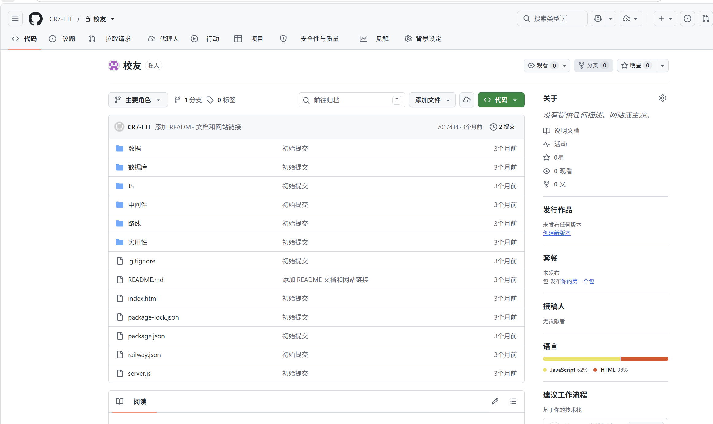
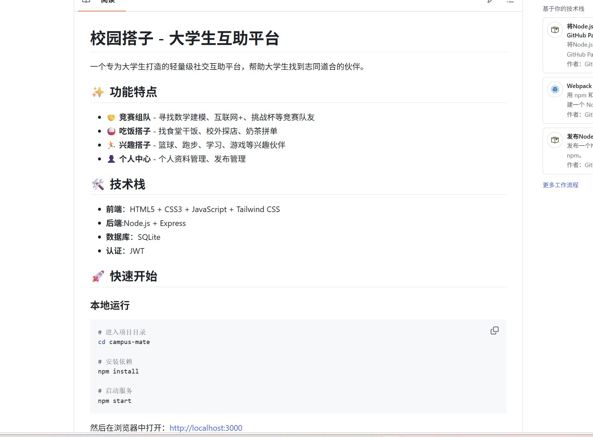
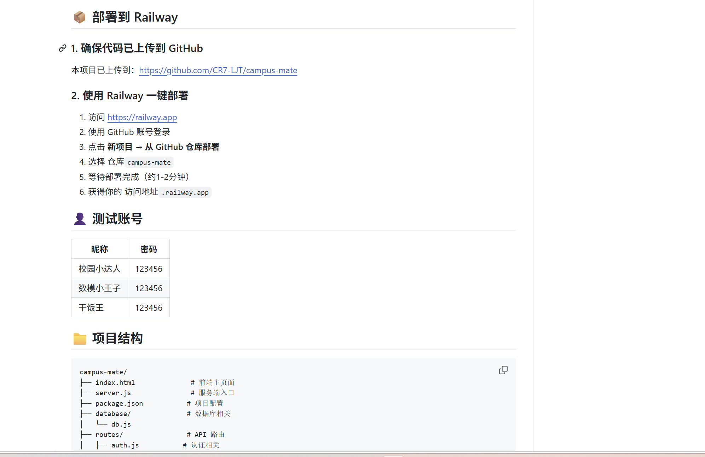

# 校园搭子 Campus Mate

一个面向大学生校园生活场景的轻量级互助社交平台，支持竞赛组队、吃饭搭子、兴趣搭子、用户登录注册、个人中心、收藏与发布管理。

> 项目定位：校园社交 / 互助组队 / 全栈 Web 应用  
> 技术栈：HTML、Tailwind CSS、JavaScript、Node.js、Express、SQLite、JWT  
> 部署方向：Railway / Node.js 服务



## 项目链接

- GitHub 仓库：https://github.com/CR7-ljt/campus-mate
- 在线部署：https://campus-mate-ruddy.vercel.app（页面已部署；账号和帖子 API 仍需配置持久化数据库后才能作为生产服务使用）

## 项目简介

Campus Mate 是一个围绕大学生日常互助需求设计的校园搭子平台。项目将“找队友”“找饭搭子”“找兴趣伙伴”等高频校园场景整合到一个 Web 应用中，用户可以注册登录、浏览不同类型的帖子、发布自己的组队需求，并在个人中心管理资料、发布内容和收藏内容。

这个项目适合作为作品集展示，因为它不仅包含静态页面，还实现了完整的前后端数据流：

- 前端页面展示与交互
- RESTful API 路由设计
- JWT 登录认证
- SQLite 数据持久化
- 用户发布、编辑、删除、收藏等业务逻辑
- Railway 部署配置；Vercel 前端发布配置

## 项目预览

### 首页与信息流



首页聚合展示竞赛组队、吃饭搭子、兴趣搭子等校园互助信息，用户可以快速浏览不同类型的需求。

### 发布与功能流程



平台支持登录后发布组队信息，并在个人中心管理资料、发布记录和收藏内容。

## 核心功能

### 用户认证

- 用户注册与登录
- 密码 bcrypt 加密存储
- JWT access token 与 refresh token
- 用户退出登录
- 获取与更新个人资料

### 竞赛组队

- 发布竞赛组队需求
- 支持竞赛类型、竞赛名称、技能要求、人数、截止日期等字段
- 支持关键词搜索和类型筛选
- 支持急招标识
- 支持作者权限校验后的编辑与删除

### 吃饭搭子

- 发布食堂约饭、校外探店、奶茶拼单等需求
- 支持时间、地点、口味偏好、备注和联系方式
- 支持关键词搜索和类型筛选
- 支持发布者编辑与删除

### 兴趣搭子

- 发布运动、学习、游戏等兴趣搭子需求
- 支持活动类型、地点、时间、持续周期和描述
- 支持按分类浏览与检索

### 个人中心

- 查看和编辑个人资料
- 查看自己的发布内容
- 收藏帖子与取消收藏
- 聚合管理竞赛、吃饭、兴趣三类发布

## 技术栈

| 层级 | 技术 |
| --- | --- |
| 前端 | HTML5、CSS3、JavaScript、Tailwind CSS CDN |
| 后端 | Node.js、Express |
| 数据库 | SQLite、better-sqlite3 |
| 认证 | JWT、bcryptjs |
| 安全与中间件 | cors、helmet、express-rate-limit、Joi |
| 部署 | Railway、Nixpacks |
| 日志 | 自定义 logger |

## 技术亮点

- **完整全栈闭环**：从前端交互、API 设计、身份认证到数据库持久化均有实现。
- **校园场景建模**：将校园互助需求拆分为竞赛、吃饭、兴趣三类业务模块，每类都有独立路由与数据表。
- **JWT 认证机制**：使用 access token 与 refresh token 维护登录状态，并将 refresh token 存入数据库。
- **SQLite 本地持久化**：使用 better-sqlite3 简化部署和本地开发，适合轻量级原型产品。
- **权限控制**：编辑和删除接口会校验发布者身份，避免用户修改他人内容。
- **部署友好**：已包含 Railway 配置，并支持通过 Railway Volume 保存数据库文件。

## 项目结构

```text
campus-mate/
├── README.md
├── index.html                  # 前端主页面
├── server.js                   # Express 服务入口
├── package.json                # 项目依赖与启动脚本
├── railway.json                # Railway 部署配置
├── .env.example                # 环境变量示例
├── assets/
│   └── screenshots/            # 作品集截图
├── docs/
│   ├── portfolio-notes.md      # 作品集展示说明
│   └── deployment.md           # 部署说明
├── database/
│   └── db.js                   # SQLite 初始化、建表、索引、数据访问
├── routes/
│   ├── auth.js                 # 注册、登录、刷新 token、退出、用户信息
│   ├── competition.js          # 竞赛组队 API
│   ├── meal.js                 # 吃饭搭子 API
│   ├── hobby.js                # 兴趣搭子 API
│   └── user.js                 # 个人中心、收藏、我的发布
├── middleware/
│   ├── errorHandler.js         # 错误处理中间件
│   └── validation.js           # 参数校验中间件
├── utils/
│   └── logger.js               # 日志工具
└── js/
    └── main.js                 # 前端交互逻辑
```

## 本地运行

### 1. 克隆项目

```bash
git clone https://github.com/CR7-LJT/campus-mate.git
cd campus-mate
```

### 2. 安装依赖

```bash
npm install
```

### 3. 配置环境变量

复制环境变量示例文件：

```bash
cp .env.example .env
```

然后根据需要修改 `.env`：

```env
PORT=3000
JWT_SECRET=please-change-this-access-secret
JWT_REFRESH_SECRET=please-change-this-refresh-secret
NODE_ENV=development
```

### 4. 启动服务

```bash
npm start
```

开发模式：

```bash
npm run dev
```

启动后访问：

```text
http://localhost:3000
```

## 测试账号

项目首次初始化数据库时会自动写入演示数据，可使用以下账号登录：

| 昵称 | 密码 |
| --- | --- |
| 校园小达人 | 123456 |
| 数模小王子 | 123456 |
| 干饭王 | 123456 |

## API 概览

### 认证模块

| 方法 | 路径 | 说明 |
| --- | --- | --- |
| POST | `/api/auth/register` | 用户注册 |
| POST | `/api/auth/login` | 用户登录 |
| POST | `/api/auth/refresh` | 刷新 token |
| POST | `/api/auth/logout` | 退出登录 |
| GET | `/api/auth/profile` | 获取当前用户信息 |

### 业务模块

| 模块 | 路径前缀 | 说明 |
| --- | --- | --- |
| 竞赛组队 | `/api/competition` | 浏览、发布、编辑、删除竞赛组队信息 |
| 吃饭搭子 | `/api/meal` | 浏览、发布、编辑、删除约饭信息 |
| 兴趣搭子 | `/api/hobby` | 浏览、发布、编辑、删除兴趣活动信息 |
| 用户中心 | `/api/user` | 更新资料、查看我的发布、管理收藏 |

## 数据库设计概览

项目使用 SQLite，并在启动时自动创建数据表和索引：

- `users`：用户资料与登录信息
- `competitions`：竞赛组队帖子
- `meals`：吃饭搭子帖子
- `hobbies`：兴趣搭子帖子
- `favorites`：用户收藏记录
- `refresh_tokens`：刷新令牌记录

本地运行时数据库文件会生成在项目根目录，文件名为 `campus_mate.db`。该文件已在 `.gitignore` 中忽略，不建议提交到公开仓库。

## 部署到 Railway

项目已经包含 `railway.json`，可直接使用 Railway 部署。

基本流程：

1. 将代码推送到 GitHub。
2. 打开 Railway 并选择 **New Project**。
3. 选择 **Deploy from GitHub repo**。
4. 选择 `campus-mate` 仓库。
5. 在 Railway 环境变量中配置：
   - `JWT_SECRET`
   - `JWT_REFRESH_SECRET`
   - `NODE_ENV=production`
6. 如需持久保存 SQLite 数据，配置 Railway Volume，并设置 `RAILWAY_VOLUME_DIR`。
7. 部署完成后访问 Railway 提供的域名。

更详细说明见：[docs/deployment.md](./docs/deployment.md)。

## 安全与公开仓库注意事项

- 不要提交 `.env` 文件。
- 不要提交本地 SQLite 数据库文件。
- 不要提交日志文件。
- 生产环境必须配置强随机的 `JWT_SECRET` 和 `JWT_REFRESH_SECRET`。
- 当前项目适合作为课程项目、原型产品和作品集展示；如果要用于真实线上业务，还需要继续加强输入校验、权限模型、风控和审计能力。

## 我的职责与收获

该项目围绕校园生活互助场景完成了从需求拆分到前后端实现的完整流程，主要工作包括：

- 设计校园搭子平台的功能模块与页面结构
- 实现用户注册、登录、资料管理等认证功能
- 设计竞赛、吃饭、兴趣三类业务数据模型
- 编写 Express RESTful API 并连接 SQLite 数据库
- 实现本地开发与 Railway 部署配置
- 整理公开仓库文档和作品集展示素材

通过这个项目，我熟悉了 Node.js + Express 的后端开发流程，掌握了 JWT 认证、SQLite 数据建模、RESTful API 设计，以及如何将一个全栈项目整理成可展示、可运行、可部署的作品集项目。

## 后续优化方向

- 增加前端构建流程，替代 Tailwind CDN
- 增加更完整的表单校验与错误提示
- 增加帖子详情页、评论或私信能力
- 增加分页、排序和更多搜索条件
- 增加自动化测试和接口测试覆盖
- 增加管理员审核和举报机制
- 将数据库迁移到 PostgreSQL，提升线上扩展能力

## 许可证

MIT License
